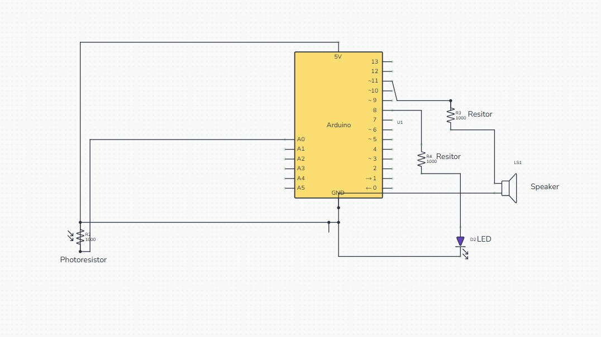

# Security Alarm System with Light Detector

## Overview

This project is a simple **security alarm system** built with **Arduino**.  
It uses a **light detector (LDR sensor module)** to detect when light is present.

When the sensor detects light:
- the **buzzer starts beeping**
- the **LED turns on**

This simulates a basic alarm system that reacts to changes in light, and it can be extended in the future with more sensors and features.

---
## Demo Video

You can watch the demo video here:

[▶ Watch the demo video](./small_vid.mp4)
## Demo Video

Click the image below to watch the demo on YouTube.

## Project Images

### Real Setup

### Schematic Plan

---

## How It Works

The system constantly reads the value from the light sensor.

- If the detected light level passes the chosen threshold:
  - the **LED lights up**
  - the **buzzer is activated**
- If there is no significant light detected:
  - the **LED stays off**
  - the **buzzer stays off**

This can be used as a very simple prototype for a light-based alarm system.

---

## Schematics Plan

The schematic / circuit plan was created using Circuit Canva

The circuit includes:
- Arduino board
- light sensor / photoresistor module
- LED
- buzzer
- resistors
- jumper wires
- breadboard

---

## Pre-requisites / Components

- [ ] Arduino board: `Arduino Uno R3`
- [ ] Light sensor / LDR module: `hw-072`
- [ ] LED: `LTL-307G Led`
- [ ] Buzzer: `Arduino buzzer`
- [ ] Resistor(s): `0.25w 10K Omega resitors * 2`
- [ ] Breadboard: `Basic Breadboard`
- [ ] Jumper wires: `Male to Male wires * 6`

---

## Setup and Build Plan

### What has already been done
- Built the physical circuit on a breadboard
- Connected the Arduino to:
  - a light detector
  - an LED
  - a buzzer
- Tested the behavior of the system
- Confirmed that:
  - when light is detected, the LED turns on
  - when light is detected, the buzzer starts beeping
- Created a schematic diagram for the circuit

### What we plan to do next
- Improve the design and cable management
- Fine-tune the light sensitivity
- Add more sensors and alarm conditions
- Extend the project with a **sound detector**
- Potentially create a more advanced multi-sensor security alarm system

---

